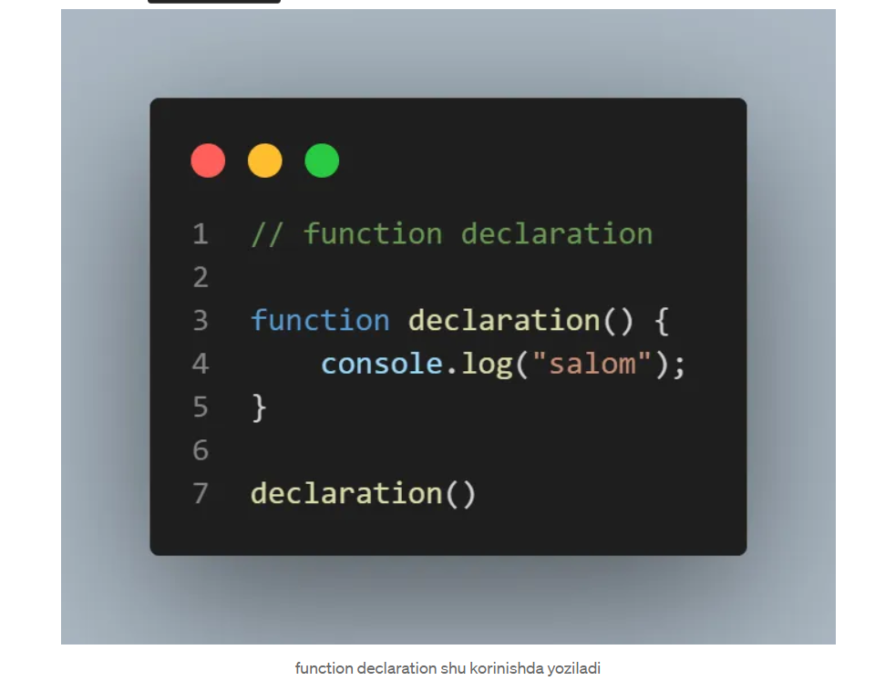
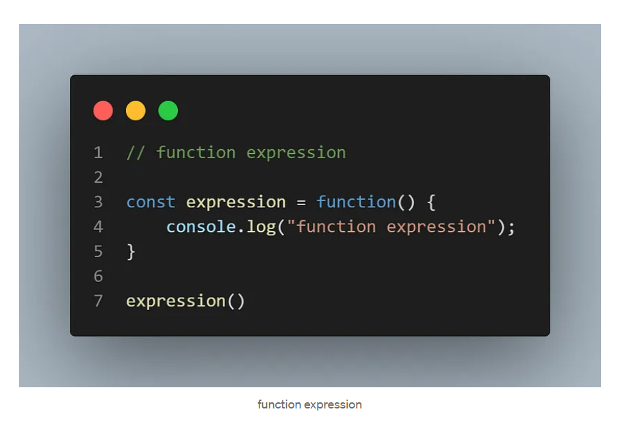
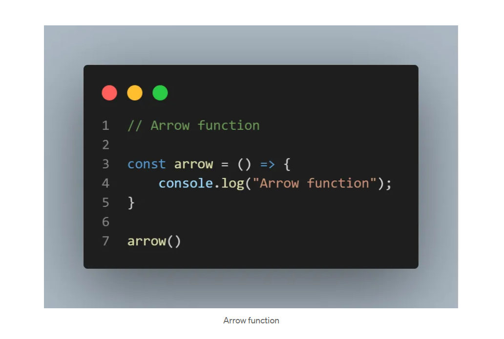
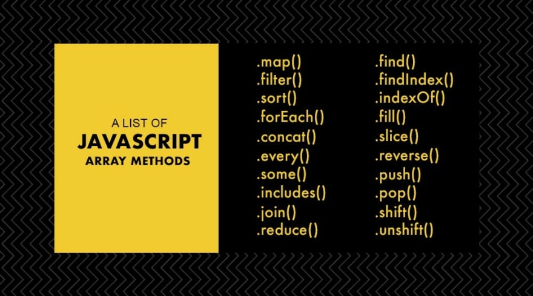
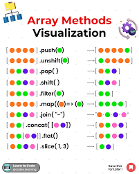

## Javascript Object vs Array , methods
- Loop
- Fuctions
- Array
-  Array methods
- Object
# Loops

### For loop
 belgilangan shart bajarilguncha bir blokni takrorlash uchun ishlatiladi. Quyidagi misol 0 dan 4 gacha bo'lgan sonlarni chiqaradi:

```javascript
for (let i = 0; i < 5; i++) {
    console.log(i);
}
```

### While loop

While loop, shart bajarilguncha bir blokni takrorlash uchun ishlatiladi. Quyidagi misol 0 dan 9 gacha bo'lgan sonlarni chiqaradi:


```javascript
let j = 0;
while (j < 10) {
    console.log(j);
    j++;
}
```
### do While loop
Do-while loop, shart bajarilguncha bir blokni takrorlash uchun ishlatiladi, ammo shart bir marta bajariladi. Quyidagi misol 0 dan 7 gacha bo'lgan sonlarni chiqaradi:
```javascript
let n = 0;
do {
    console.log(k);
    n++;
} while (k < 8);

```

# Function
## JavaScript da 3ta function bor bular :

- Fucntion declarations:
- Function expression:
- Function arrow:


### 1-Function declaration =>



### function declaration pilus taraflaridan biri bu functioni , function dan oldin ham chaqirib ishlatsak boladi .


### 2-Function expression =>



### function expression shu korinishda boladi , uni bitta ozagruvchiga olib ishlatamiz , uni misularidan bittasi ubi function dan oldin ishlatib bolmaydi , yanni functioni tepada yozishga togri keladi , function declaration da esa hohlagan joyda yozib ketish mumkin boladi .

### 3- Arrow function =>



### Arrow function korinishi shunaqa boladi , arrow function ham huddi function expression ga oxshab faqat functiondan keyin chaqirish mumkin boladi , va arrow functionlarni pilus laridan biri kamroq kod yoziliahida dir . yanni function() sozi orniga “() =>” shuni yozib qoysaq boldi .

# Array vs array methods

## Massivning yaratilishi va elementlarni qo'shish:
```javascript
// Massiv yaratish
let fruits = ['Apple', 'Banana', 'Cherry'];

// Element qo'shish
fruits.push('Date');// oxiridan qo'shadi//
fruits.unshift('Apricot');//oldidan qo'shadi//

console.log(fruits); // ["Apricot", "Apple", "Banana", "Cherry", "Date"]

```

## Massivdan ma'lumot o'chirish:
```javascript
// Biror elementni o'chirish
let removed = fruits.pop(); // Oxirgi elementni o'chiradi

// Biror elementni o'chirish
removed = fruits.shift(); // Boshidagi elementni o'chiradi

```

## Massivning qisman qo'shilishi:
```javascript
let vegetables = ['Carrot', 'Potato'];

// Arrayni birlashtirish
let combined = fruits.concat(vegetables);
console.log(combined); // ["Apple", "Banana", "Cherry", "Carrot", "Potato"]

```
Bu misollar JavaScript massivlarini yaratish, elementlarini qo'shish, o'chirish,  qidirishni ko'rsatadi. Bu funksiyalar qo'llaniladigan ko'plab hodisalar bor va ularning qo'llanilishi dasturlashda juda muhimdir.

## Sonlar massivi (Numeric Array):
```javascript
let numbers = [1, 2, 3, 4, 5];
console.log(numbers); // [1, 2, 3, 4, 5]

```

## Matnlar massivi (String Array):
```javascript
let colors = ['Red', 'Green', 'Blue'];
console.log(colors); // ["Red", "Green", "Blue"]

```

## Booleantlar massivi (Boolean Array):
```javascript
let students = [
    { name: 'John', age: 20 },
    { name: 'Alice', age: 22 },
    { name: 'Bob', age: 21 }
];
console.log(students);
/*
[
    { name: 'John', age: 20 },
    { name: 'Alice', age: 22 },
    { name: 'Bob', age: 21 }
]
*/

```

## Bu misollar JavaScript massivlarining turli turdagi ma'lumotlar bilan qanday ishlashiga oid. Ular dasturlashda qo'llaniladigan eng ko'p ishlatiladigan dasturlash elementlaridan biridirlar.


## Array method turlari va tshunishingiz uchun misollar:

# Array Turlari


# Array vazifalari:

